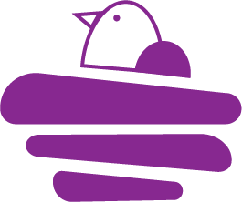
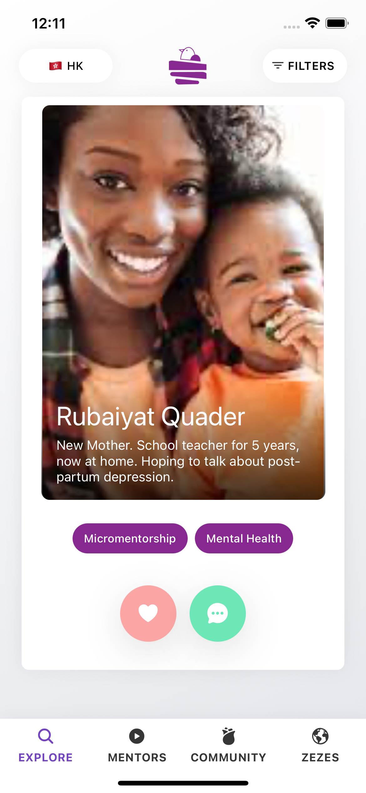
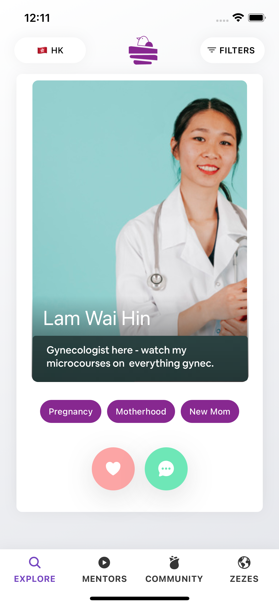
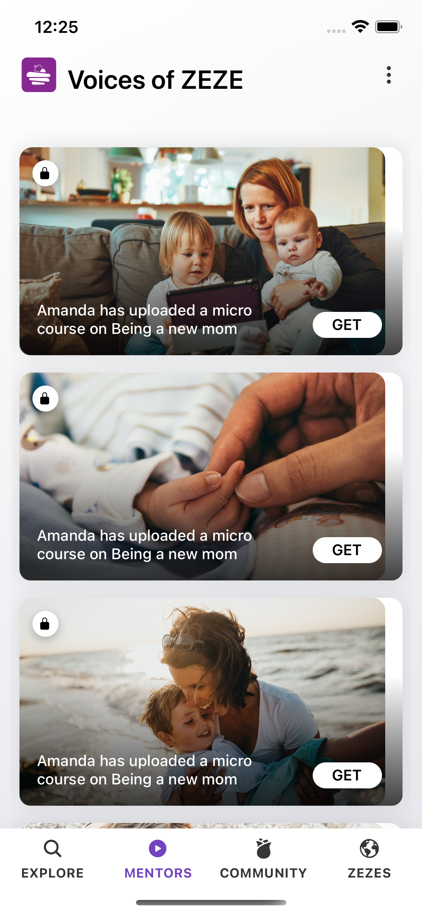
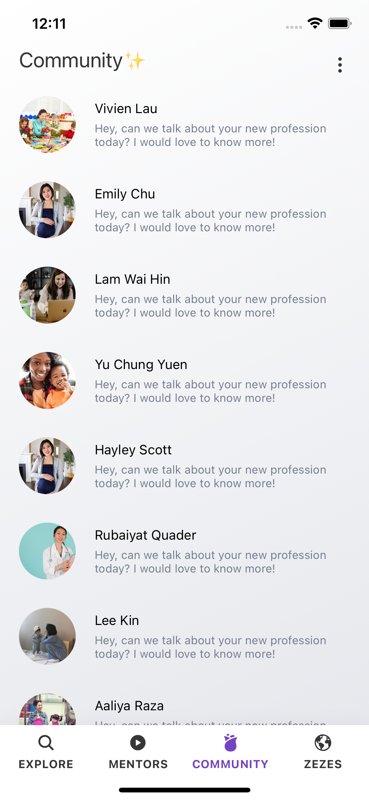
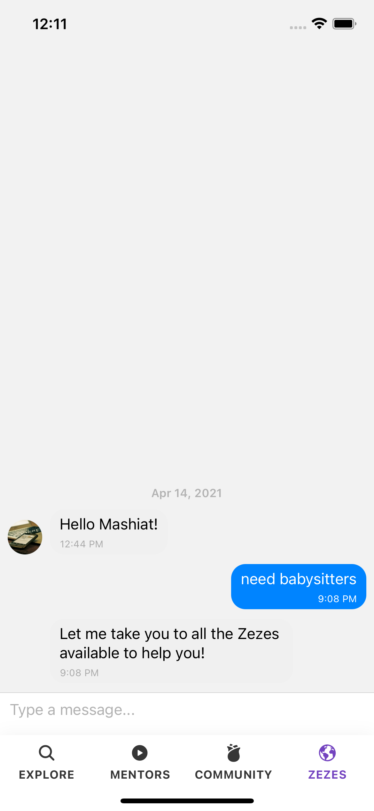

# ZEZE


## Overview

ZeZe - meaning sister in cantonese, is an app that uses a smart algorithm that uses Data Driven Matchmaking for Moms and Services.
This is to function as a support system for women, made by women. We want to connect working women with other working women, like a sister helping another sister, by collaborating with other progressive business movements, we belive we can influence each other to share our struggles. This is also a platform for women to generate some revenue through content creation.

We want to include women’s perspectives and concerns more intentionally. We want to create a foundation for a new social and economic order among working moms.


 4 screens are availables : Explore, Mentors, Community and Zezes. You'll find some components like Card Component to pass props and variant. No frameworks UI like Bootstrap or Material UI are used.

- **Easy to use** 🤘
- **Made with Expo** ⚡
- **TypeScript supported** 🌞


## Demo

You can try it here : https://expo.io/@mlamisa/projects/zeze

## Screenshots









## Installation and usage

Be sure, you have installed all dependencies and applications to run Expo project on your computer : [Getting Started with Expo](https://docs.expo.io/get-started/installation/).

This project works fine on iOS and Android.


### Running the project

Clone this repository :

```
git clone https://github.com/Mashiat31/Zeze
cd zeze-expo
```

Install packages :

```shell
yarn # OR
npm install
```

When installation is complete, run it :

```shell
yarn start # OR
npm run start
```


